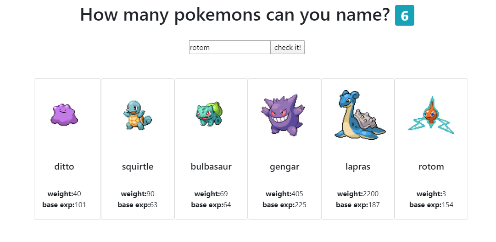

# Development of app that provides reports about performance of generator sets, for AERCOM.SA.

Full development of an app that provides monthly reports about performance of generator sets, for AERCOM.SA. 
The reports were formerly created manually, ony by one, by an electrical technician. 

The development consisted of a system that stores and analyses raw data given from generator sets, and creates reports with an analysis of the performance of the set. 
The parameters and rules to interpret data were created and tested along with an electrical technician provided by Aercom.
The app has a simple interface for the technician to edit the reports before approval. 
The app has been confectionnig all performance reports that Aercom uses internally and delivers to clients since 2021.

Can't show the actual app because of legal agreement with Aercom. 

Javascript, Node.js, HTML, CSS

# Count syllables in Spanish

Count syllables of any word in Spanish, displayed in a learning friendly way. It identifies hiatos, diptongos, repeated letters, indivisible pair of characters, and other characteristics, and count syllables with a set of rules hierarchically organized, condensed in one easy to read function. 

## <a href="https://pablolucianop.github.io/count-syllables-in-spanish/" target="_blank" rel="noopener noreferrer">Try it!</a>

## Author

- **Pablo Panza** - [pablolucianop](https://github.com/pablolucianop), https://pablopanzatrabajos.com.ar/

## License
This project is licensed under the MIT License - see the [LICENSE.md](LICENSE.md) file for details

# How many pokemons can you name?
 
 Simple react app that challenges you to name pokemons, and lists the ones that you spelled correctly. 

## <a href="https://pablolucianop.github.io/mascotSpelling/" target="_blank" rel="noopener noreferrer">DEMO</a>

## Built With

* [React](https://reactjs.org/) - JavaScript library
* [Axios](https://github.com/axios/axios) - Promise based HTTP client for the browser and node.js
* [Pokeapi](https://pokeapi.co/) - The RESTful Pokémon API

# Collaborative project - Teach dog a trick

## <a href="https://pablolucianop.github.io/teach-dog-a-trick/index.html" target="_blank" rel="noopener noreferrer">DEMO</a>

Anyone interested in adding something to a small project? I'm looking to gain some experience in collaborative work and git in general.
This is my proposition: Teach this dog a trick!

I have built a simple 3D model of a dog. You can join in, teach the dog do something new: roll over when a button is pressed. Close eyes when the cursor passes through the forehead. Teach him to help you evade taxes, etc...

Two redditors have already contributed! Brianpeiris teach the dog how to play fetch, and leogardiner to play dead.
I have edited the code so it's easier to read.

Contact me or just fork this repository, add some code and I will merge it!

## Built With

-   [Three.js](https://threejs.org/) - three.js – JavaScript 3D library
-   [3DS MAX](https://www.autodesk.com/products/3ds-max) - 3Ds Max – 3D modeling and rendering software for design visualization, games, and animation

## Authors

-   **Pablo Panza** - Model the dog and set the bases - [pablolucianop](https://github.com/pablolucianop), https://pablopanzatrabajos.com.ar/

-   **Brian Peiris** - Though the dog to play fetch - [brianpeiris](https://github.com/brianpeiris)

-   **leogardiner** - Though the dog to play dead - [leogardiner](https://github.com/leogardiner)

-   **pfeinberg** - Give the dog a park to run, and tought to come when called - [pfeinberg](https://github.com/pfeinberg)

# Golden Ratio Constellation

## <a href="https://pablolucianop.github.io/goldenRatioConstellation/" target="_blank" rel="noopener noreferrer">DEMO Golden Ratio Constellation</a>

*Elements arranged by golden ratio spiral

## Built With

* [Three.js](https://threejs.org/) - three.js – JavaScript 3D library
* [3DS MAX](https://www.autodesk.com/products/3ds-max) - 3Ds Max – 3D modeling and rendering software for design visualization, games, and animation

## Author

* **Pablo Panza** - *Initial work* - [pablolucianop](https://github.com/pablolucianop), https://pablopanzatrabajos.com.ar/

## License

This project is licensed under the MIT License - see the [LICENSE.md](LICENSE.md) file for details

## Acknowledgments

* Numberphile, The Golden Ratio (why it is so irrational) -  https://www.youtube.com/watch?v=sj8Sg8qnjOg

# Endless Triangle

## <a href="https://pablolucianop.github.io/endlessTriangle/" target="_blank" rel="noopener noreferrer">DEMO Endless Triangle</a>

This is a js version of 'the game of chaos' proposed in the book 'Randomness in everyday life' by Alberto Rojo. The source code is written as a step by step demonstration. 

 The instructions are:
* 1 define a triangle
* 2 pick the a random 'First Point', inside this triangle.
* 3 pick a random vertex of the triangle previously defined
* 4 find the middle point between the chosen vertex and that 'First Point', and push it into an array
* 5 define the middle the point between the point defined before and a random vertex of our triangle, and draw this point
* 6 repeat a lot of times 

## Author

* **Pablo Panza** - *Initial work* - [pablolucianop](https://github.com/pablolucianop), https://pablopanzatrabajos.com.ar/

## License

This project is licensed under the MIT License - see the [LICENSE.md](LICENSE.md) file for details

## Acknowledgments

* Alberto Rojo, author of: El azar en la vida cotidiana. Buenos Aires, Siglo XXI, 2012. -  https://es.wikipedia.org/wiki/Alberto_Rojo

